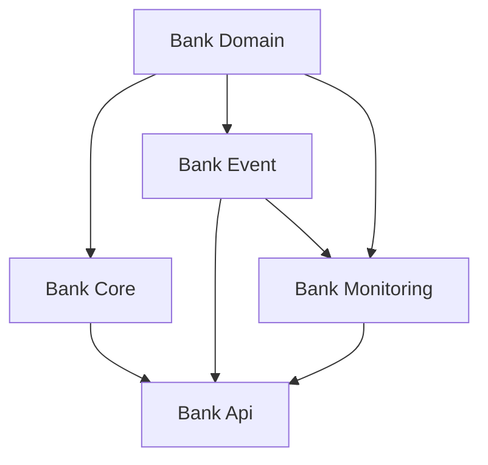

# multi-module-practice Project

## 1. 프로젝트 소개
이 프로젝트는 **Spring Boot 기반 멀티 모듈 구조**를 학습하기 위해 만든 연습용 프로젝트입니다.  
단일 모듈로 개발할 때와 비교하여, 멀티 모듈 구조가 어떤 장점과 단점을 가지는지 직접 경험하고,  
실무에서 멀티 모듈을 적용할 때 고려해야 할 점을 익히는 것이 목적입니다.

---

## 2. 멀티 모듈을 공부하게 된 이유
- 프로젝트가 커질수록 **관심사 분리(Separation of Concerns)** 가 필요해짐
- 도메인 단위로 모듈을 나누어 **재사용성, 유지보수성, 독립적인 테스트**가 용이
- 실제 MSA(Microservice Architecture)로 확장할 때 **사전 학습** 효과
- 실무 코드에서 점점 **멀티 모듈/멀티 레포지토리 구조**가 보편화되는 추세라 필요성을 느낌

---

## 3. 멀티 모듈의 장단점

### 장점
- **관리성 향상**: 기능별로 모듈을 분리하여 코드 가독성과 유지보수 용이성 증가
- **병렬 개발**: 팀 단위로 독립적인 모듈 개발 가능
- **재사용성**: 공통 기능을 별도 모듈로 분리하여 다른 프로젝트에서도 활용 가능
- **확장성**: 모듈 단위 배포, 테스트, 교체가 용이
- **추적 용이성**: 문제가 생겼을 때 특정 모듈 범위에서만 원인 추적 가능

### 단점
- **초기 설정 비용**: build.gradle, settings.gradle 등 설정이 복잡
- **의존성 관리 어려움**: 모듈 간 순환 의존성 방지 필요
- **작은 규모에서는 오히려 비효율**: 프로젝트가 작다면 단일 모듈이 더 단순하고 생산적

---

## 4. 배운 점
- [멀티 모듈을 위한 gradle 설정 방법](https://github.com/HyunJng/multi-module-practice/blob/main/docs/setting-report.md)
  - 모듈 간 **의존성 주입(DI) 구조 설계** 방식
  - `subprojects`, `allprojects` 차이와 언제 어떤 블록을 써야 하는지
- [장단점을 살펴보며 실제 프로젝트에서 **어떤 경우 멀티 모듈을 적용하는 것이 좋은지**에 대한 기준](https://github.com/HyunJng/multi-module-practice/blob/main/docs/multimodule-reason.md)

---

## 5. 프로젝트 구조

## 6. 기술 스택 및 버전
- **JDK**: 17
- **Spring Boot**: 3.2.3
- **Spring Dependency Management**: 1.1.4
- **Kotlin**: 2.0.21  
- **Gradle**: 8.x (Kotlin DSL 기반)

