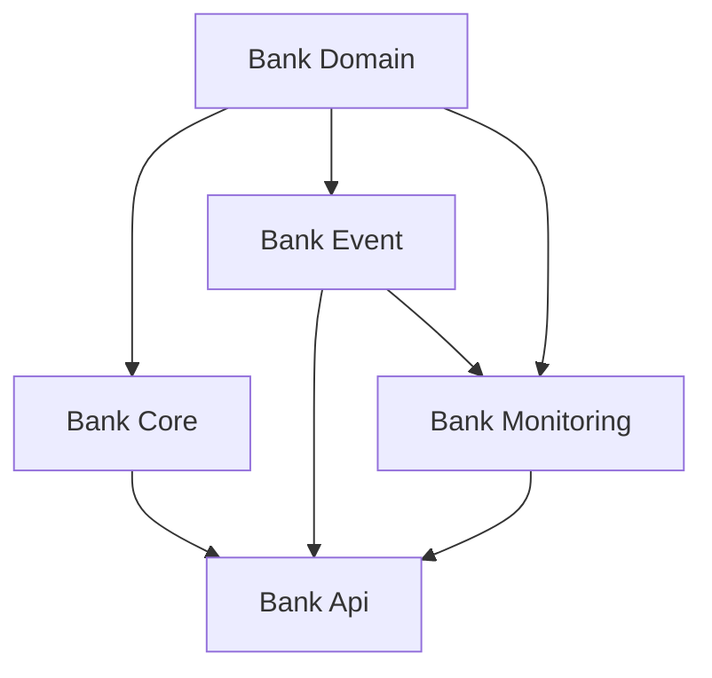

# 멀티모듈 설정 보고서
## 0. 모듈 설계

## 1. plugins 블록

```kotlin
plugins {
    id("org.springframework.boot") version "3.2.3" apply false
    id("io.spring.dependency-management") version "1.1.4" apply false
    kotlin("jvm") version "2.0.21" apply false
    kotlin("plugin.spring") version "2.0.21" apply false
    kotlin("plugin.jpa") version "2.0.21" apply false
}
```

* **공통적으로 사용할 플러그인을 선언**하는 부분.
* `apply false` → 여기서는 선언만 해두고, 실제 적용은 `subprojects`에서 조건에 따라 붙여줌.
  즉, "필요한 모듈에서만 꺼내 쓰겠다"는 의미.

주요 플러그인들:
* `org.springframework.boot`
  Spring Boot 앱 실행, 패키징(jar/war) 같은 기능 제공.
* `io.spring.dependency-management`
  스프링 진영에서 제공하는 BOM(Bill of Materials) 버전 관리 도구. 라이브러리 버전 충돌 방지.
* `kotlin("jvm")`
  코틀린 코드를 JVM 바이트코드로 컴파일할 수 있도록 함.
* `kotlin("plugin.spring")`
  코틀린과 Spring을 잘 연동하기 위해 필요한 기능 제공(예: `open class` 자동 처리).
* `kotlin("plugin.jpa")`
  JPA 엔티티 클래스에서 코틀린 특성(`final class`, `no default constructor`) 때문에 생기는 문제를 자동으로 해결해줌.

---

## 2. allprojects 블록

```kotlin
allprojects {
    group = "org.multiodule"
    version = "0.0.1-SNAPSHOT"
    description = "multi-module-practice"

    repositories {
        mavenCentral()
    }
}
```

* **모든 프로젝트(루트 + 서브모듈) 공통 설정**.
* `group`, `version` → Maven 좌표(groupId, version). 빌드 산출물 이름 관리.
* `repositories` → 라이브러리를 받아올 저장소 설정.

> **plugins와 allprojects의 차이**
> 
> * `plugins` 블록 
>   * 플러그인 선언. 빌드 스크립트에 필요한 플러그인.
>   * Gradle이 프로젝트 설정을 읽는 시점(configuration phase) 에 플러그인 자체를 가져와서 사용할 준비만 함
> * `allprojects` 블록
>   * group, version, repositories 같은 Gradle의 빌드 메타정보를 통일할 때 사용.
---

## 3. subprojects 블록

```kotlin
subprojects {
    apply(plugin = "kotlin")
    apply(plugin = "io.spring.dependency-management")

    if (name == "bank-api") {
        apply(plugin = "org.springframework.boot")
        apply(plugin = "org.jetbrains.kotlin.plugin.spring")
        apply(plugin = "org.jetbrains.kotlin.plugin.jpa")
    }

    if (name == "bank-core") {
        apply(plugin = "org.jetbrains.kotlin.plugin.spring")
    }

    if (name == "bank-domain") {
        apply(plugin = "org.jetbrains.kotlin.plugin.jpa")
    }

    tasks.withType<Test> {
        useJUnitPlatform()
    }

    tasks.withType<org.jetbrains.kotlin.gradle.tasks.KotlinCompile> {
        kotlinOptions {
            jvmTarget = "17"
            freeCompilerArgs += "-Xjsr305=strict"
        }
    }
}
```

* **각 모듈에 공통적으로 적용할 설정**을 정의.
* 공통적으로 `kotlin`, `dependency-management`는 다 사용.
* 모듈별로 다른 역할에 맞춰 필요한 플러그인 추가:

    * **bank-api**: 실제 Spring Boot 실행 애플리케이션 → `spring boot`, `spring plugin`, `jpa` 다 필요.
    * **bank-core**: 비즈니스 로직 중심 → `spring`만 필요.
    * **bank-domain**: JPA 엔티티 관리 중심 → `jpa`만 필요.
* `tasks.withType<Test>` → JUnit5 사용 설정.
* `tasks.withType<KotlinCompile>` → 코틀린 컴파일 옵션 (JVM 타겟 17, null-safety 관련 `-Xjsr305=strict`).

---

## 왜 이렇게 나눴나?

* **멀티모듈의 목적**: 역할에 따라 모듈을 나눠서 관심사 분리.

    * API 모듈은 실행 가능한 Spring Boot 애플리케이션.
    * Core 모듈은 서비스 로직, 유즈케이스.
    * Domain 모듈은 엔티티와 DB 매핑.
* 플러그인도 **모듈의 역할에 맞게 최소한만 적용** 
→ 불필요한 의존성 줄이고 모듈 간 결합도를 낮추는 효과.
